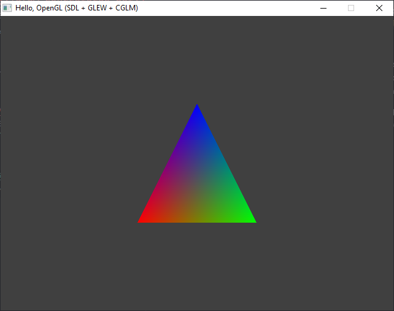

# SDL + OpenGL

O exemplo `src\07-hello_gl` usa duas bibliotecas adicionais (em comparação com os exemplos anteriores):

- **GLEW (The OpenGL Extension Wrangler Library)** para verificar quais extensões OpenGL estão disponíveis na plataforma-alvo e configurá-las/usá-las corretamente.

  - Disponível em [https://glew.sourceforge.net/](https://glew.sourceforge.net/)
  - Considerando a configuração inicial dos exemplos deste repositório, baixar os binários "Windows 32-bit and 64-bit" e descompactar em uma pasta `glew`, na mesma pasta `libs` onde a SDL3 foi descompactada.

- **OpenGL Mathematics (glm) for C** para realizar cálculos matemáticos necessários em algumas operações OpenGL.

  - Disponível em [https://github.com/recp/cglm](https://github.com/recp/cglm)
  - Considerando a configuração inicial dos exemplos deste repositório, baixar o código-fonte e colocar os arquivos em uma pasta `cglm`, na mesma pasta `libs` onde a SDL3 foi descompactada.

Consulte os arquivos `src\07-hello_gl\makefile` e `src\07-hello_gl\.vscode\*.json` para exemplos de como as bibliotecas foram configuradas na máquina e como o projeto pode ser compilado.