# Linguagem C e biblioteca SDL

## Sumário

1. [Apresentação](#apresentação)
2. [Ferramentas](#ferramentas)
3. [Versão da SDL: 3.x](#versão-da-sdl-3x)
4. [Instalação da SDL](#instalação-da-sdl)
5. [Hello, World! com SDL](#hello-world-com-sdl)
6. [Corrigindo erros no vscode](#corrigindo-erros-no-vscode)
7. [Compilando e executando o programa no vscode](#compilando-e-executando-o-programa-no-vscode)
8. [Compilando e executando o programa pelo terminal](#compilando-e-executando-o-programa-pelo-terminal)
9. [Bônus: Makefile](#bônus-makefile)
10. [Referências SDL](#referências-sdl)
11. [Sobre](#sobre)


## Apresentação

[⇱ Voltar para sumário](#sumário)

Este artigo descreve uma maneira de configurar uma máquina com o sistema operacional Windows (10/11) para começar o desenvolvimento de programas GUI (*Graphical User Interface*) usando a linguagem de programação **C** e a biblioteca **SDL** (*Simple DirectMedia Layer*).

O material foi escrito pelo professor **André Kishimoto**, para a disciplina de **Computação Visual** do curso de **Ciência da Computação** da **Universidade Presbiteriana Mackenzie** (**FCI - Faculdade de Computação e Informática**).


## Ferramentas

[⇱ Voltar para sumário](#sumário)

Neste material, usaremos as seguintes ferramentas (Windows 10/11):

- **vscode**: [https://code.visualstudio.com](https://code.visualstudio.com)

- **MinGW/gcc**: [https://code.visualstudio.com/docs/cpp/config-mingw](https://code.visualstudio.com/docs/cpp/config-mingw) (estou assumindo que você seguiu os passos deste link para instalar o compilador gcc na máquina).


## Versão da SDL: 3.x

[⇱ Voltar para sumário](#sumário)

Com o lançamento oficial da SDL3, usaremos exclusivamente a **SDL3**.

- Em 21/01/2025, foi publicada a versão oficial da SDL3: [https://github.com/libsdl-org/SDL/releases/tag/release-3.2.0](https://github.com/libsdl-org/SDL/releases/tag/release-3.2.0)

- Porém, em 04/08/2025, foi lançada a **versão 3.2.20** (stable bugfix release) - ***essa será a versão adotada na disciplina!***: [https://github.com/libsdl-org/SDL/releases/tag/release-3.2.20](https://github.com/libsdl-org/SDL/releases/tag/release-3.2.20).


## Instalação da SDL

[⇱ Voltar para sumário](#sumário)

O jeito mais direto de "instalar" a SDL é acessar o link do [release-3.2.20](https://github.com/libsdl-org/SDL/releases/tag/release-3.2.20) e baixar o arquivo equivalente ao compilador usado durante o desenvolvimento.

Considerando que usaremos o MinGW, o arquivo a ser baixado é esse: [https://github.com/libsdl-org/SDL/releases/download/release-3.2.20/SDL3-devel-3.2.20-mingw.zip](https://github.com/libsdl-org/SDL/releases/download/release-3.2.20/SDL3-devel-3.2.20-mingw.zip)

Depois, seguir a documentação disponível em [https://github.com/libsdl-org/SDL/blob/main/docs/README-windows.md](https://github.com/libsdl-org/SDL/blob/main/docs/README-windows.md).

**No entanto**, não segui a documentação acima porque não usei o CMake. Assim, a forma que instalei a SDL3 na minha máquina foi com os seguintes passos:

- Após descompactar o arquivo `SDL3-devel-3.2.20-mingw.zip`, criei uma pasta `D:\dev\compvis\libs` (você pode escolher outra).

- Copiei a pasta `x86_64-w64-mingw32` que foi descompactada do arquivo `SDL3-devel-3.2.20-mingw.zip` para `D:\dev\compvis\libs` e a renomeei para `SDL3`. O conteúdo da pasta `D:\dev\compvis\libs\SDL3` ficou assim:

    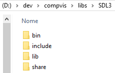


## Hello, World! com SDL

[⇱ Voltar para sumário](#sumário)

Para o primeiro exemplo com SDL, criei uma pasta `hello` dentro de `D:\dev\compvis` e, dentro da pasta `hello`, o arquivo `main.c` com o código a seguir.

Talvez você se depare com alguns erros - neste caso, veja a próxima seção ([Corrigindo erros no vscode](#corrigindo-erros-no-vscode)).

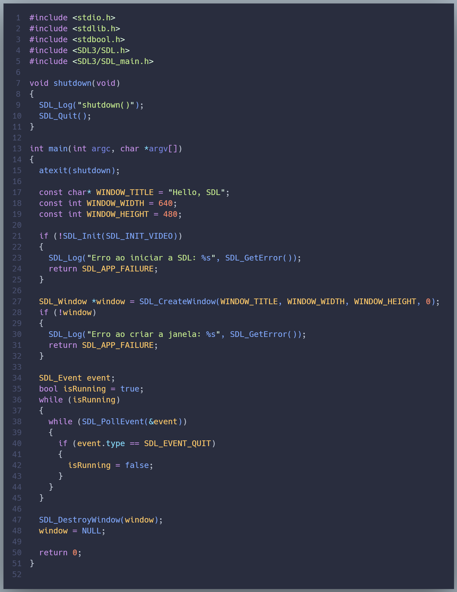


## Corrigindo erros no vscode

[⇱ Voltar para sumário](#sumário)

Quando adicionamos o `#include <SDL3/SDL.h>` e o `#include <SDL3/SDL_main.h>` no código do arquivo `main.c`, o vscode pode apresentar um erro indicando que não consegue abrir o arquivo `"SDL3/SDL.h"`:

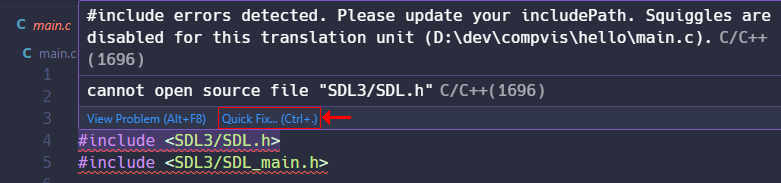

Para resolver este problema:

1. Escolha a opção ***Quick Fix... (Ctrl+.)***, indicado pela seta vermelha  seta na figura acima.

2. Em seguida, escolha a opção ***Edit "includePath" setting***, conforme indicado na figura abaixo.

    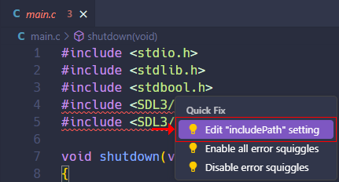

3. Na aba ***C/C++ Configurations***, navegue até a seção ***Include path*** e, na caixa de texto ***One include path per line.***, insira o caminho onde você colocou a pasta da SDL3, incluindo a pasta `include`. No exemplo da figura a seguir, o caminho indicado foi `d:/dev/copmvis/libs/SDL3/include`.

    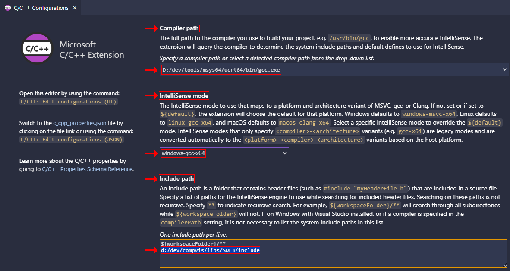

Dependendo da configuração da máquina, pode ser interessante alterar as seguintes seções (destacadas na imagem acima):

- ***Compiler path***: Indicar o compilador `gcc` correto (na figura acima, o compilador GCC está instalado em `D:/dev/tools/msys64/ucrt64/bin/gcc.exe`).

- ***IntelliSense mode***: Indicar a plataforma `windows-gcc-x64` (assumindo que o compilador GCC é para Windows 64 bits).

Com essas alterações, o problema do vscode não reconhecer os `#include`s e identificadores da biblioteca SDL é resolvido.

**Observação:** o vscode cria um arquivo `c_cpp_properties.json` em uma pasta `.vscode` localizada na pasta raiz (a pasta que você abriu no vscode). Esse arquivo contém configurações para compilação C e C++, tais como: caminho do compilador, modo Intellisense e caminho dos includes que o compilador consulta durante o processo de compilação.


## Compilando e executando o programa no vscode

[⇱ Voltar para sumário](#sumário)

Na primeira vez que você executar a opção do menu `Run | Start Debugging` ou `Run | Run Without Debugging`, o vscode pedirá para você escolher o depurador e a configuração a ser executada. Escolha a opção que tem o compilador `gcc` correto:

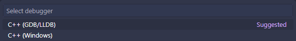

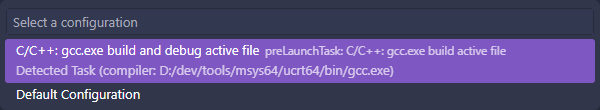

Após a seleção, o vscode começa o processo de compilação, mas, provavelmente, você encontrará um erro de compilação:

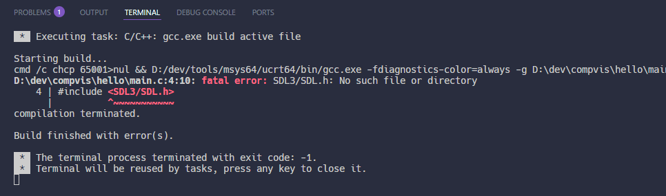

Visão na aba ***Problems***:

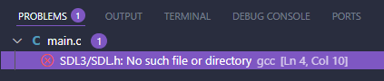

O problema é que o `gcc` não encontra o arquivo `SDL3/SDL.h` indicado no `#include <SDL3/SDL.h>`. Para resolver este problema, precisamos passar alguns parâmetros para o compilador.

A passagem de parâmetros é feita editando o arquivo `tasks.json` que o vscode cria na pasta `.vscode`, após a primeira vez que tentamos executar o programa.


### Atualizando o arquivo `tasks.json` (novos argumentos para o compilador)

Localize a chave `"args"` no arquivo `tasks.json`. Deve ser algo parecido com a próxima figura:

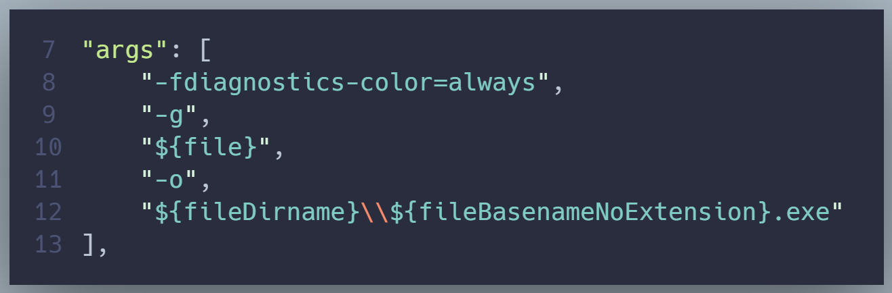

Altere o valor associado à chave `"args"`, adicionando três novos argumentos:

```json
"-Id:/dev/compvis/libs/SDL3/include",
"-Ld:/dev/compvis/libs/SDL3/lib",
"-lSDL3"
```

Lembrando que `d:/dev/compvis/libs/SDL3/` é o local onde a SDL foi instalada - caso necessário, reveja a seção [Instalação da SDL](#instalação-da-sdl).

Na figura a seguir, temos o trecho do arquivo `tasks.json` modificado. Observe que, na linha 12, precisamos adicionar uma vírgula após `"${fileDirname}\\{$fileBasenameNoExtension}.exe"`, para depois inserir os três novos argumentos.

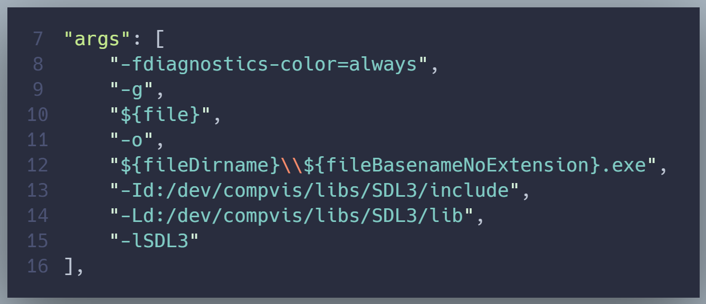

Salve o arquivo `tasks.json`, volte para o arquivo `main.c` e rode-o pelo vscode.

Provavelmente, o processo de compilação agora será concluído com sucesso (*"Build finished successfully."* na aba ***Output***) e o vscode alternará para a aba ***Terminal*** para executar o nosso programa, executando uma instrução com vários parâmetros  na linha de comando.

Porém, **nada acontece...!**


### Debug Console

Se você abrir a aba ***Debug Console***, observará que o GNU gdb (`GDB`) foi iniciado, mas logo em seguida foi encerrado com um erro *"ERROR: Unable to start debugging. (...) The program (...) has exited with code 0."*

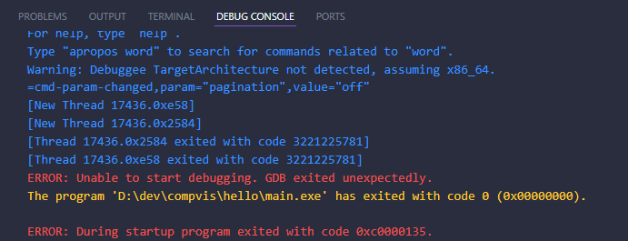

O problema, neste caso, é que o nosso programa SDL depende da biblioteca dinâmica `SDL3.dll` para rodar. Essa DLL está disponível na pasta `bin` da SDL (por exemplo, `D:/dev/compvis/libs/SDL3/bin`). Você pode copiar o arquivo `SDL3.dll` no mesmo local onde se encontra o arquivo executável do nosso programa e, em seguida, rodar o programa.

No entanto, para não realizar essa cópia do arquivo DLL manualmente, podemos automatizar a tarefa no processo de build, editando novamente o arquivo `tasks.json`.


### Atualizando o arquivo `tasks.json` (automação da cópia do arquivo `SDL3.dll`)

Vá ao final do arquivo `tasks.json` e localize a chave `"detail"`.

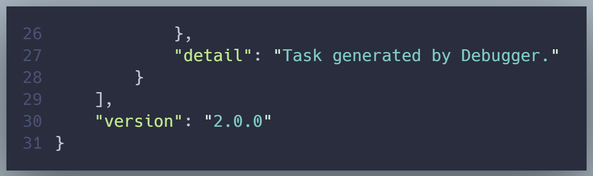

Adicione o conteúdo a seguir logo depois da linha que contém a chave `"detail"`:

```json
  , "dependsOn": [
    "copy_dll"
  ]
},
{
  "type": "shell",
  "label": "copy_dll",
  "detail": "Copy SDL3.dll to program folder.",
  "command": "cmd",
  "args": [
    "/c",
    "copy",
    "d:\\dev\\compvis\\libs\\SDL3\\bin\\SDL3.dll",
    "${fileDirname}"
  ]
}
```

O resultado dessa modificação pode ser visto na figura a seguir:

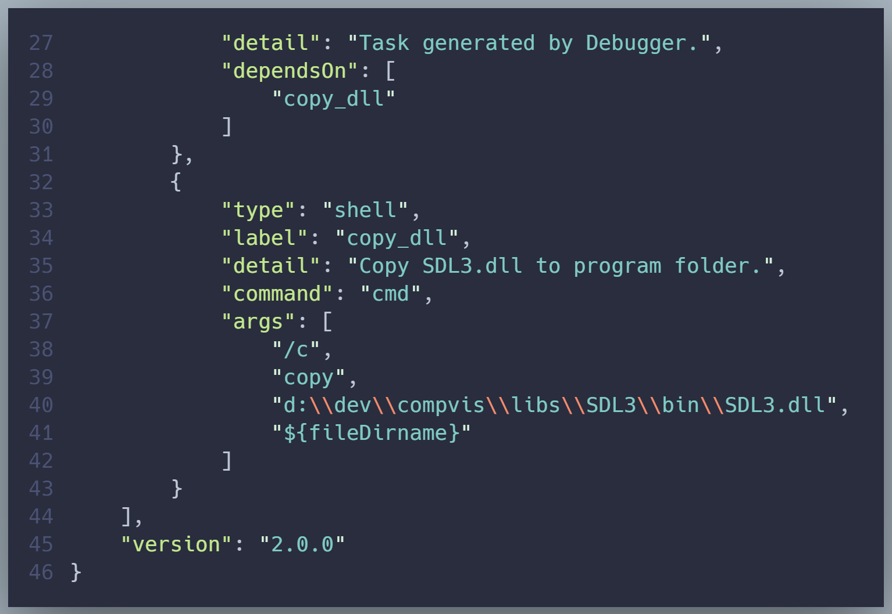

Há três pontos importantes sobre o novo conteúdo inserido no arquivo `tasks.json`:

1. O comando `cmd` com o argumento `copy` é específico para Windows (linha 36).

2. O argumento `"d:\\dev\\compvis\\libs\\SDL3\\bin\\SDL3.dll"` deve ser modificado de acordo com a localização da SDL na sua máquina (linha 40).

3. Você pode inserir a vírgula no final do conteúdo da linha 27 (`"detail": "..."`) ou no início da linha 28.

O conteúdo inserido me parece ser auto-explicativo, mas, para não ficar dúvidas, o que essas instruções fazem é indicar que o processo de build (a ***task*** com *"label": "C/C++: gcc.exe build active file"*) depende da ***task*** com *"label": "copy_dll"*.

Assim, antes da compilação do nosso código, o vscode faz uma chamada ao *prompt* de comando do Windows (`cmd`) e copia o arquivo `SDL3.dll` da pasta `SDL3\bin` para `${fileDirname}`, sendo que, neste caso, `${fileDirname}` é o local onde se encontra o nosso arquivo `main.c`.

Feitas as alterações, salve o arquivo `tasks.json`, volte para o arquivo `main.c` e rode-o novamente pelo vscode.

Se tudo der certo, você verá que o vscode executa duas tarefas de build na aba ***Terminal*** e que o programa é executado corretamente, exibindo uma janela de resolução 640x480 pixels, com fundo preto e título ***Hello, SDL***.

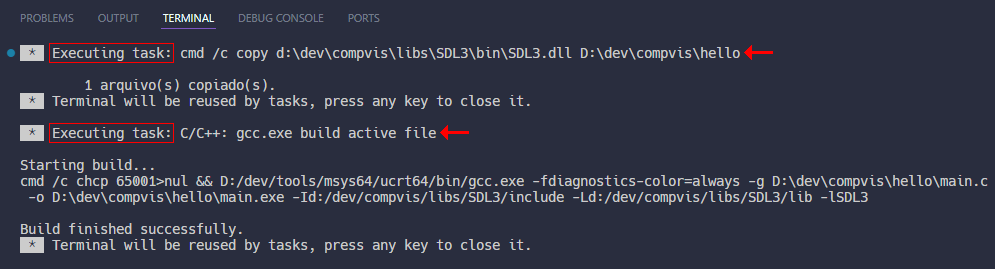

Resultado final:

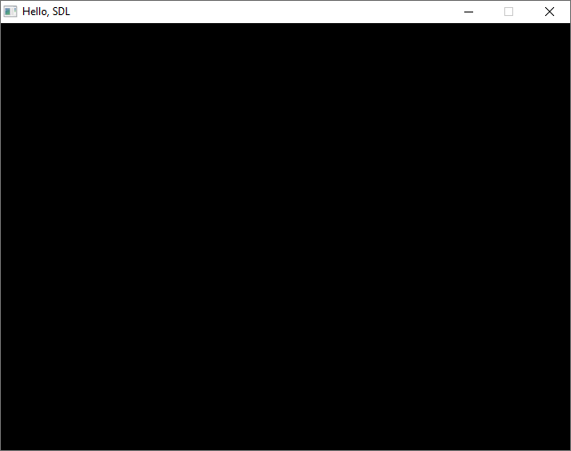


## Compilando e executando o programa pelo terminal

[⇱ Voltar para sumário](#sumário)

Outra possibilidade para compilar e executar o programa é fazer o processo pelo terminal (no próprio vscode ou executando o *prompt* de comando do Windows).

Independentemente de qual terminal você usar, navegue até a pasta onde está localizado o arquivo `main.c`. Por exemplo, se o arquivo `main.c` estiver na pasta `d:\dev\compvis\hello`, você pode executar as seguintes instruções (após cada linha de instrução, você deve pressionar a tecla *Enter*):

```
d:
cd d:/dev/compvis/hello
gcc main.c -Id:/dev/compvis/libs/SDL3/include -Ld:/dev/compvis/libs/SDL3/lib -lSDL3 -o main.exe
copy d:/dev/compvis/libs/SDL3/bin/SDL3.dll ./
```

A primeira instrução acessa o drive `D:` da máquina.

A segunda instrução altera o local atual do drive `D:` para `d:/dev/compvis/hello` (o comando `cd` significa *change directory*, algo como *trocar de diretório ou pasta*).

A terceira instrução invoca o compilador `gcc` com argumentos que definem qual arquivo com código-fonte C deve ser compilado (`main.c`), os includes e bibliotecas SDL (`-Id:/dev/... -Ld:/dev/... -lSDL3`) e qual é o executável gerado durante a compilação (`-o main.exe`).

A quarta instrução copia o arquivo `SDL3.dll` para o local atual do terminal.

Lembre-se, novamente, que `d:/dev/compvis/libs/SDL3` foi o local escolhido para instalação da SDL (ver seção [Instalação da SDL](#instalação-da-sdl)) e que você deve alterar esse valor caso tenha escolhido outro local.

Por fim, você pode rodar o executável do programa de algumas maneiras (assumindo que você já esteja no local correto onde o arquivo `main.exe` foi gerado pelo `gcc`):

- Se estiver no terminal do vscode, digite `./main` e pressione *Enter*.
- Se estiver no *prompt* do Windows (`cmd`), digite `main` e pressione *Enter*.
- Pelo *Windows Explorer*, navegue na pasta onde o programa foi compilado e dê um duplo-clique no arquivo `main.exe`.

Um detalhe curioso é que, se o programa executável `main.exe` for iniciado diretamente pelo *Windows Explorer*, você verá que, além da janela do programa, um terminal também é aberto e permanece aberto até que o programa seja encerrado (saídas de instruções como `printf()` aparecem nesse terminal).

Caso não queira esse comportamento, você pode adicionar a flag `-mwindows` como argumento para o compilador `gcc`, tanto na linha de comando quanto no arquivo `tasks.json`.


## Bônus: Makefile

[⇱ Voltar para sumário](#sumário)

Criei um `makefile` para não precisar invocar o `gcc` com diversos parâmetros, manualmente, toda vez que quiser compilar o código do programa (e, na compilação com `makefile`, uso parâmetros adicionais do `gcc`).

Neste caso, considerando o uso do MinGW, abra o terminal (interno do vscode ou *prompt* de comando do Windows), navegue até o local onde estão localizados os arquivos `main.c` e `makefile`, e insira a seguinte instrução:

```
mingw32-make
```

Caso queira limpar o projeto (apagar os arquivos de código-objeto, executável e `SDL3.dll`), use a seguinte instrução:

```
mingw32-make clean
```

Em caso de erro, é provável que você precise editar o conteúdo do arquivo `makefile` com as configurações da sua máquina.


## Referências SDL

[⇱ Voltar para sumário](#sumário)

- Site oficial da SDL: [https://libsdl.org](https://libsdl.org)
- Documentação oficial da SDL: [https://wiki.libsdl.org/SDL3](https://wiki.libsdl.org/SDL3)


## Sobre

[⇱ Voltar para sumário](#sumário)

Copyright (c) 2025 André Kishimoto.